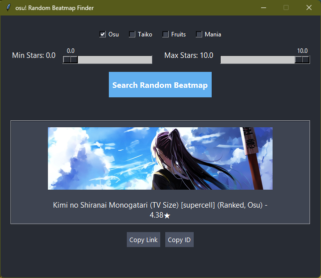

# ORB!GPT
osu! random beatmap finder made using chatgpt (the following readme is also made with chatgpt).

This is a simple Python GUI application that fetches a completely random osu! beatmap with status `ranked`, `loved`, or `qualified`, using the official osu! API.

## 🔧 Features

- Get a random beatmap with status `ranked`, `loved`, or `qualified`
- Filters out maps that are not in `osu!standard` mode
- Fully responsive GUI
- Clickable beatmap link and buttons to copy:
  - beatmapset link
  - beatmapset ID

## 🖼️ Screenshot



## 🚀 Requirements

- Python 3.7+
- `requests` library
- `pillow` library

Install dependencies with:

```bash
pip install requests
pip install pillow
```
## 🛠️ Setup

- Clone this repository.

- Edit the script with your own OSU_CLIENT_ID and OSU_CLIENT_SECRET.
You can get them from your osu! OAuth app: https://osu.ppy.sh/home/account/edit#oauth

- Run the script:
```bash
  python main.py
```
